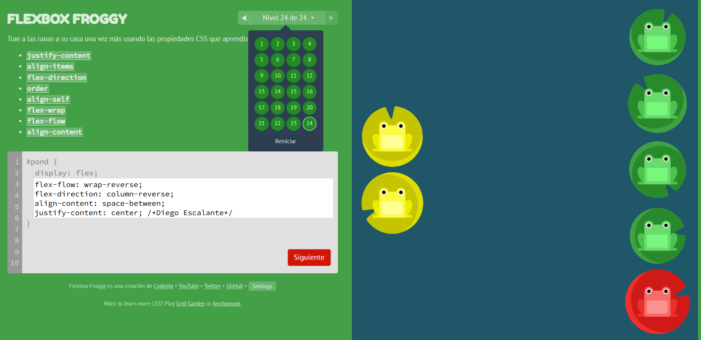
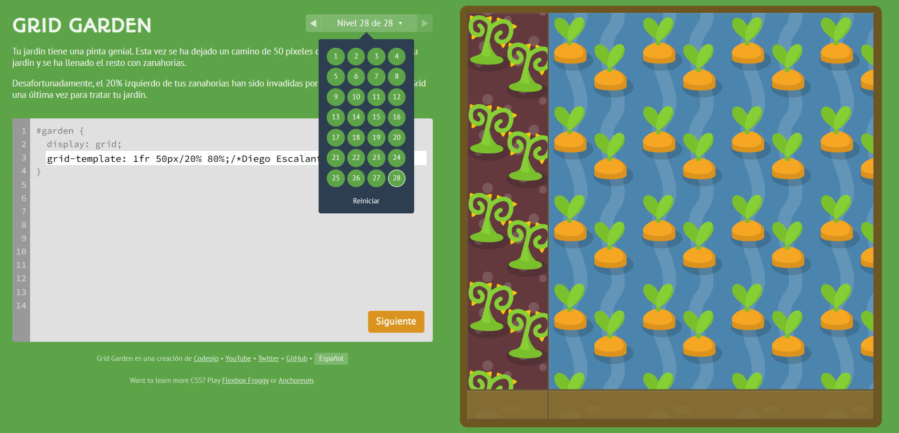

[](https://classroom.github.com/a/1X0oeuiC)

Nombre: Diego Eduardo Escalante Garcia
Github Page: https://dsaw-2025-i.github.io/my-cv-part-c-frog-carrots-deploy-DiegoEscalante/

# Ejercicios
## Flexbox Froggy



## Grid Garden



# Bienvenidos a la Tarea de HTML y CSS

¡Hola a todos!

En esta tarea, vamos a crear nuestra propia hoja de vida (CV) utilizando HTML y CSS. Este ejercicio está dividido en dos partes para que puedan enfocarse primero en la estructura y luego en el diseño.

## Parte 1: HTML

### Objetivo
Crear la estructura de tu CV utilizando solo HTML.

### Instrucciones
1. Crea un archivo llamado `index.html`.
2. Dentro de este archivo, define la estructura básica de un documento HTML.
3. Agrega los siguientes elementos a tu CV:
    - Un encabezado con tu nombre.
    - Una sección de información personal (por ejemplo, dirección, teléfono, correo electrónico).
    - Una sección de educación (lista de instituciones educativas y fechas).
    - Una sección de experiencia laboral (lista de trabajos anteriores, cargos y fechas).
    - Una sección de habilidades (lista de tus habilidades).
    - Una sección de intereses o hobbies.

### Comentarios
```html
<!-- Este es un comentario -->
<!-- Estructura básica del documento HTML -->
<!DOCTYPE html>
<html lang="es">
<head>
    <meta charset="UTF-8">
    <meta name="viewport" content="width=device-width, initial-scale=1.0">
    <title>Mi CV</title>
</head>
<body>
    <!-- Aquí va el contenido de tu CV -->
</body>
</html>
```

## Parte 2: CSS

### Objetivo
Aplicar estilos a tu CV utilizando solo CSS.

### Instrucciones
1. Crea un archivo llamado `styles.css`.
2. Enlaza este archivo CSS a tu archivo HTML utilizando la etiqueta `<link>`.
3. Aplica los siguientes estilos:
    - Colores y fuentes que hagan tu CV atractivo.
    - Márgenes y padding para espaciar bien los elementos.
    - Estilos para listas, encabezados y párrafos.
    - Diseña una layout que haga tu CV fácil de leer.

### Comentarios
```css
/* Este es un comentario */
/* Enlace tu CSS al HTML */
<link rel="stylesheet" href="styles.css">

/* Aquí van tus estilos CSS */
body {
    font-family: Arial, sans-serif;
    margin: 0;
    padding: 0;
    background-color: #f4f4f4;
}

h1 {
    color: #333;
}

section {
    margin: 20px;
    padding: 20px;
    background-color: #fff;
    border: 1px solid #ddd;
    border-radius: 5px;
}
```

## Ideas para iniciar
- Piensa en un diseño limpio y profesional.
- Utiliza recursos en línea como [Google Fonts](https://fonts.google.com/) para elegir una buena tipografía.
- Experimenta con combinaciones de colores que sean agradables a la vista.

¡Buena suerte y diviértanse creando su CV!
